

  <h1 class="text-align: center;font-weight: bold">Praktikum 3 Praktek System Operasi</h1>
  <h3 class="text-align: center;">Dosen Pengampu : Dr. Ferry Astika Saputra, S.T., M.Sc.</h3>

 

  
  <h3 style="text-align: center;">Disusun Oleh : </h3>
  

    <strong>Dewangga Wahyu Putera Wangsa (3123500007)</strong> 
    <strong>Hawa Kharisma Zahara (3123500010)</strong> 
    <strong>Bayu Ariyo Vonda Wicaksono (3122500017)</strong>
  

<h3 style="text-align: center;line-height: 1.5">Politeknik Elektronika Negeri Surabaya Departemen Teknik Informatika Dan Komputer Program Studi Teknik Informatika 2023/2024</h3>
  

## Daftar Isi

1. [PPT](#ppt)
2. [FLOPS dan IOPS](#flops-dan-iops)
   - [Install gcc, make, dan git](#install-gcc-make-dan-git)
   - [How to run FLOPS dan IOPS](#how-to-run-flops-dan-iops)
   - [Tabel Pengujian](#tabel-pengujian)
   - [Analisa](#analisa)
3. [Referensi](#referensi)

## PPT

[Link PPT](https://www.canva.com/design/DAF_FjVZneE/mGYFV4pIDyYAnDvjwu0qfg/view?utm_content=DAF_FjVZneE&utm_campaign=designshare&utm_medium=link&utm_source=editor)

## FlOPS dan IOPS

### Install GCC, make, dan GIT

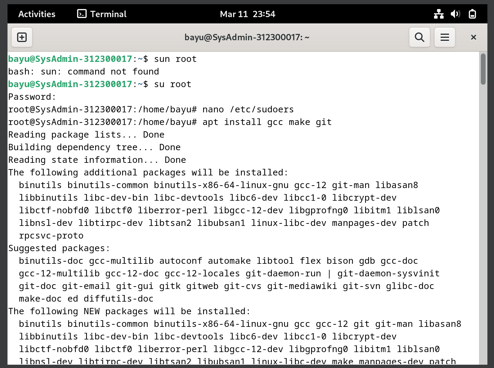

### How to run FLOPS dan IOPS

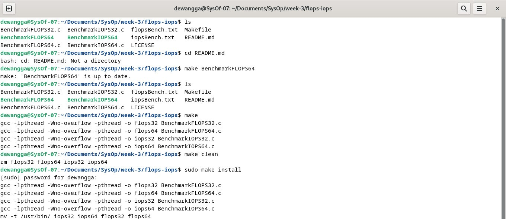

1. Awang
   Percobaan FLOPS64 5 kali
   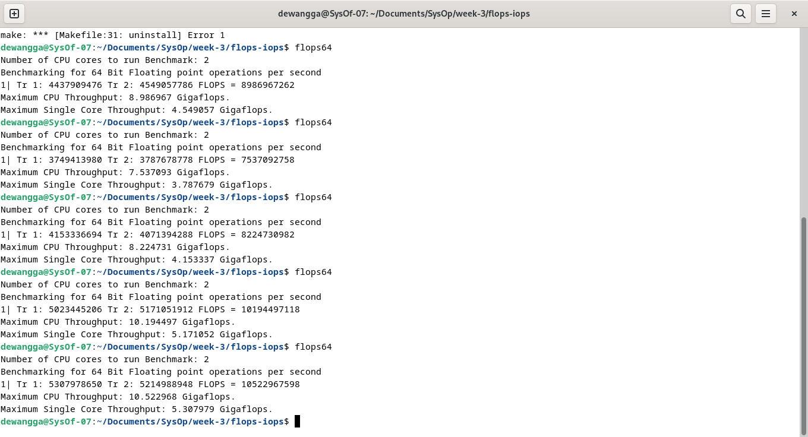
   Percobaan IOPS64 5 kali
   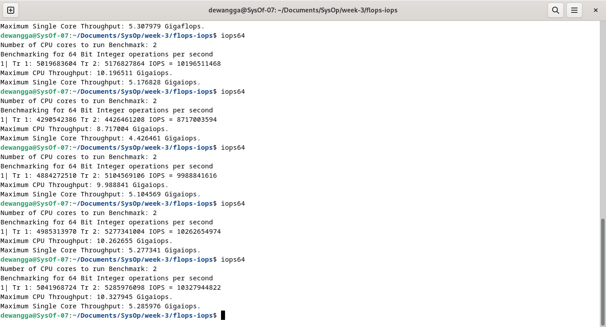
2. Hawa
   Percobaan FLOPS64 5 kali
   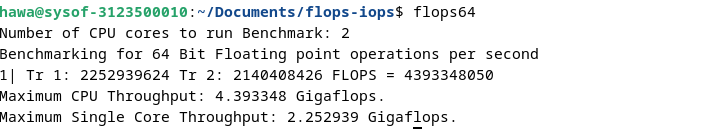
   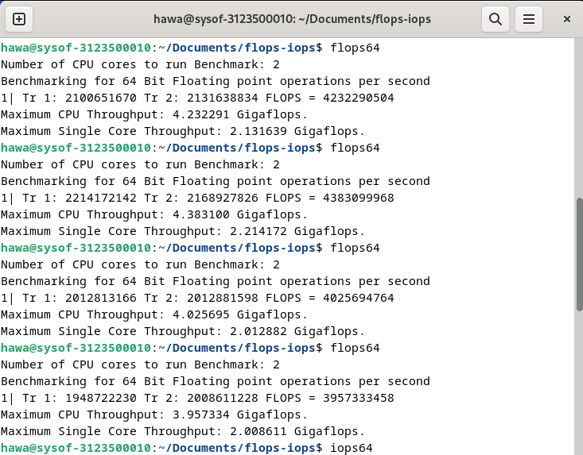
   Percobaan IOPS64 5 kali
   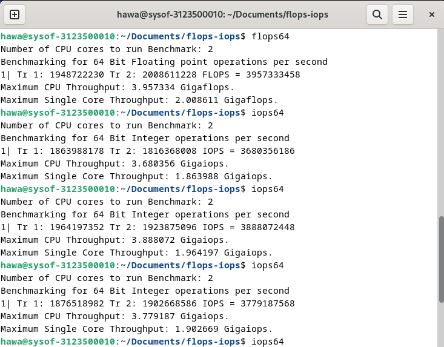
   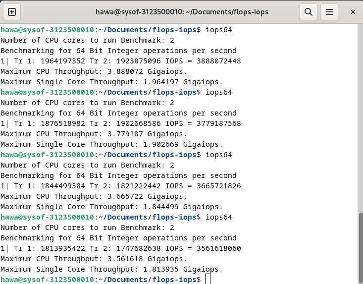
3. Vonda
   Percobaan FLOPS64 5 kali
   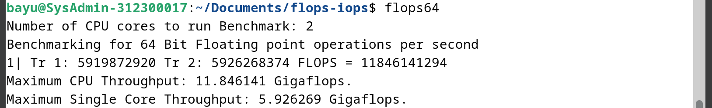
   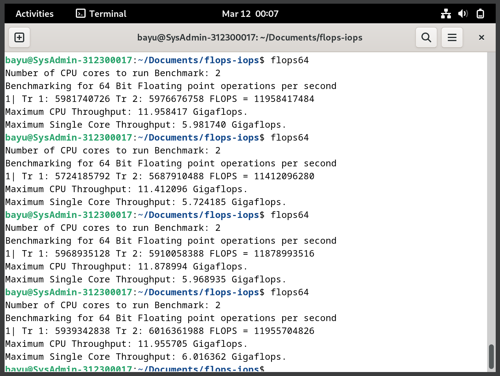
   Percobaan IOPS64 5 kali
   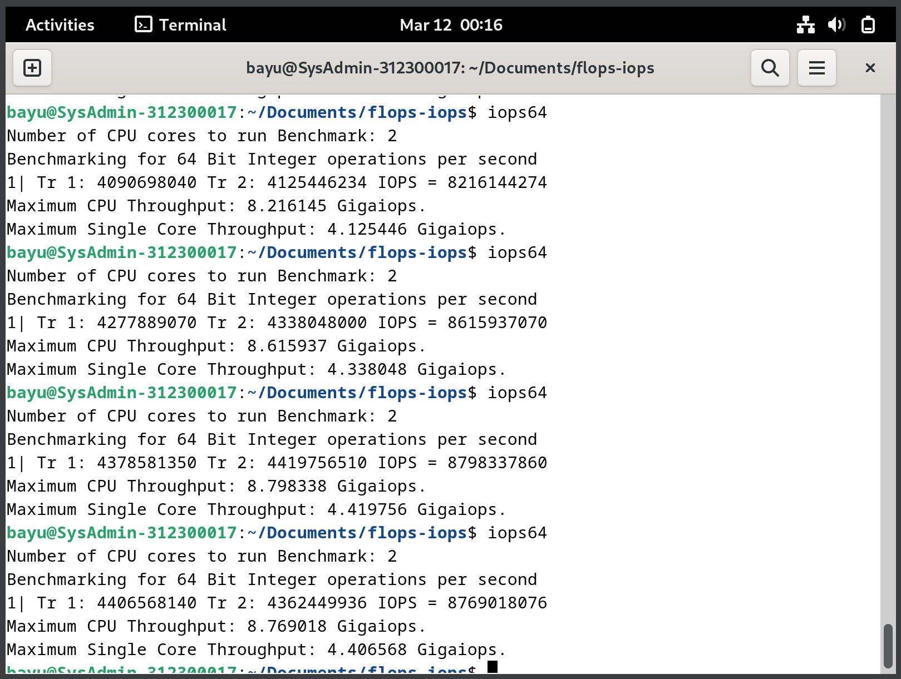
   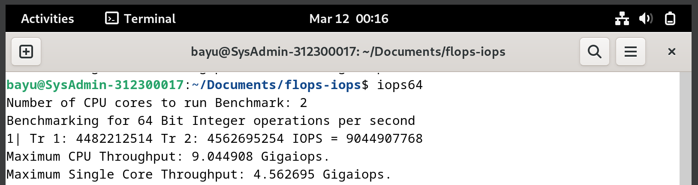

### Tabel Pengujian

| Nama Anggota | Max Single Core FLOPS | Max Single Core IOPS | Max CPU FLOPS | Max CPU IOPS |
| ------------ | --------------------- | -------------------- | ------------- | ------------ |
| Awang        | 5.3                   | 5.2                  | 10.5          | 10.3         |
| Hawa         | 2.2                   | 1.9                  | 4.3           | 3.8          |
| Vonda        | 6                     | 4.5                  | 11.9          | 9            |

#### Analisa

Dari data yang ditunjukkan oleh table diatas menunjukkan bahwa setiap laptop dengan ketidaksamaan processor menyebabkan hasil dari test FLOPS dan IOPS berbeda-beda tergantung kecepatan dari masing-masing CPU/processor.
Mulai dari **Awang** dengan spesifikasi **Processor 11th Gen Intel(R) Core(TM) i3-1115G4 @ 3.00GHz, 2995 Mhz, 2 Core(s), 4 Logical Processor(s)**, untuk spesifikasi yang ada di debian menggunakan 2 core, bisa memperoleh angka 5.3 Gigaflops dan 5.2 Gigaiops di single core dan Max CPU berada di angka 10.5 Gigaflops dan 10.3 Gigaiops.
Lalu **Hawa** dengan spesifikasi **Processor Intel(R) Celeron(R) N4000 CPU @ 1.10GHz, 1101 Mhz, 2 Core(s), 2 Logical Processor(s)**, untuk spesifikasi yang ada di debian menggunakan 2 core, bisa memperoleh angka 4.3 Gigaflops dan 3.8 Gigaiops di single core dan Max CPU berada di angka 2.2 Gigaflops dan 1.9 Gigaiops.
lalu **vonda** dengan spesifikasi **13th Gen Intel(R) Core(TM) i5-13500H, 2600 Mhz, 12 Core(s), 16 Logical Proces**, untuk spesifikasi yang ada di debian menggunakan 2 core, bisa memperoleh angka 6 Gigaflops dan 4.5 Gigaiops di single core dan Max CPU berada di angka 11.9 Gigaflops dan 9 Gigaiops.

### Kesimpulan

Dari percobaan kelompok kami, bisa ditarik kesimpulan bahwa Perbandingan antara FLOPS dan IOPS tidak langsung karena keduanya mengukur aspek yang berbeda dari kinerja sistem komputasi. FLOPS lebih berkaitan dengan kemampuan prosesor untuk melakukan perhitungan matematika, sedangkan IOPS lebih berkaitan dengan kemampuan sistem penyimpanan untuk mengakses dan memanipulasi data. Meskipun keduanya merupakan ukuran kinerja yang penting dalam konteks tertentu, mereka tidak dapat secara langsung dibandingkan atau ditukar-tukar karena masing-masing mengukur aspek yang berbeda dari kinerja sistem komputasi.

## Referensi

- [Apa itu CPU?](https://www.youtube.com/watch?v=Z5JC9Ve1sfI)
- [Siklus CPU](https://www.youtube.com/watch?v=jFDMZpkUWCw)
- [FLOPS dan IOPS](https://github.com/ferryastika/flops-iops)
